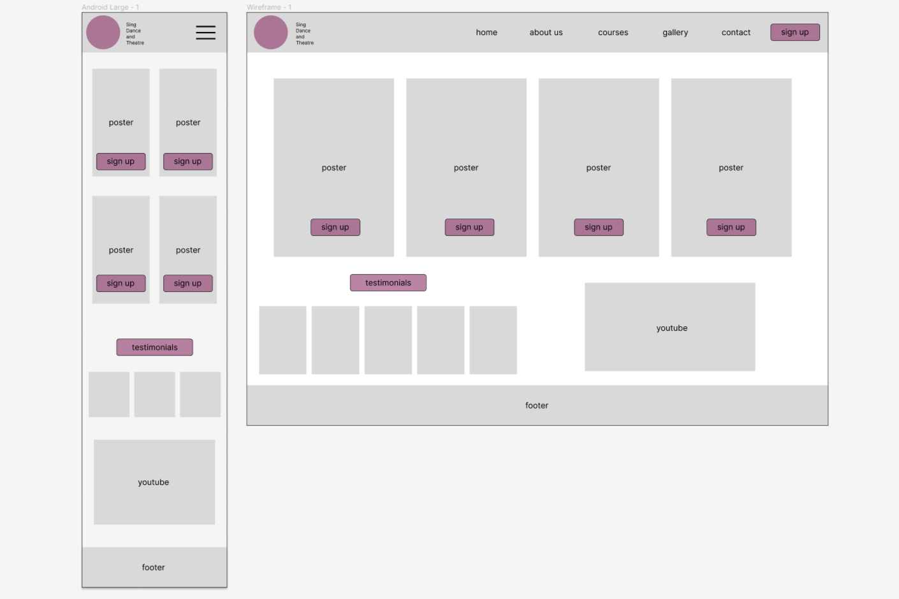
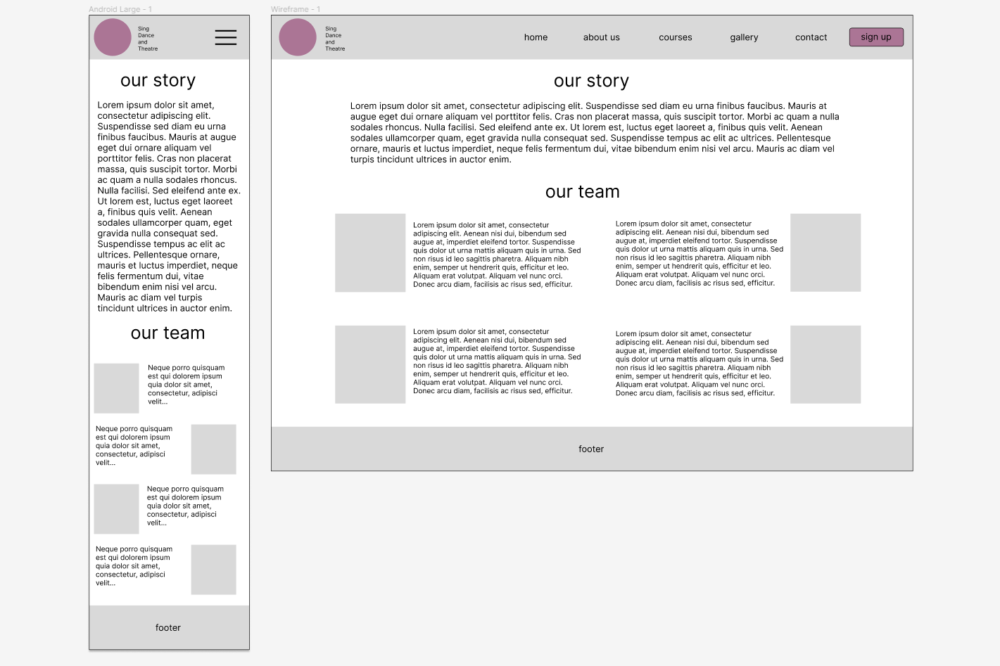
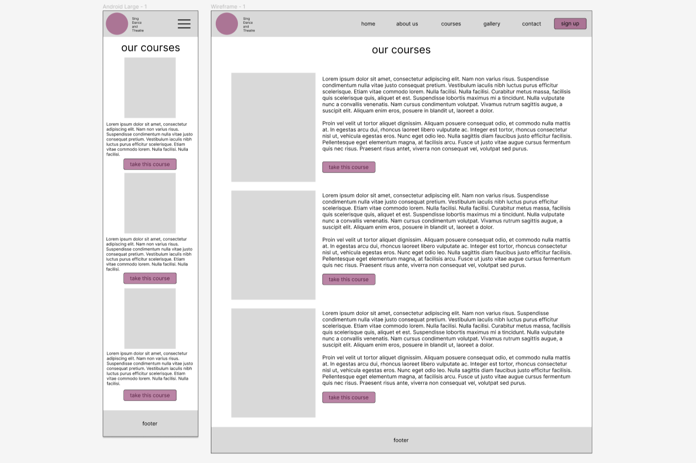
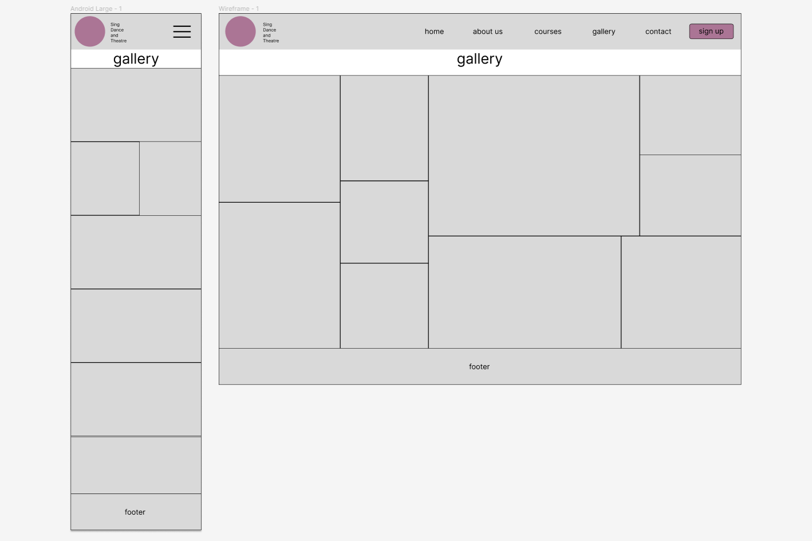
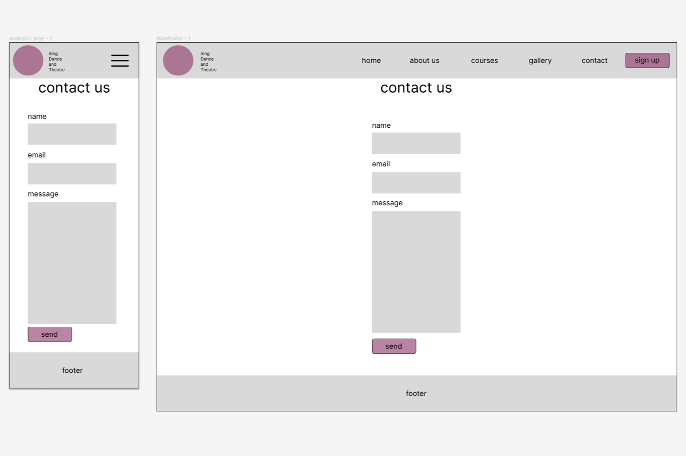
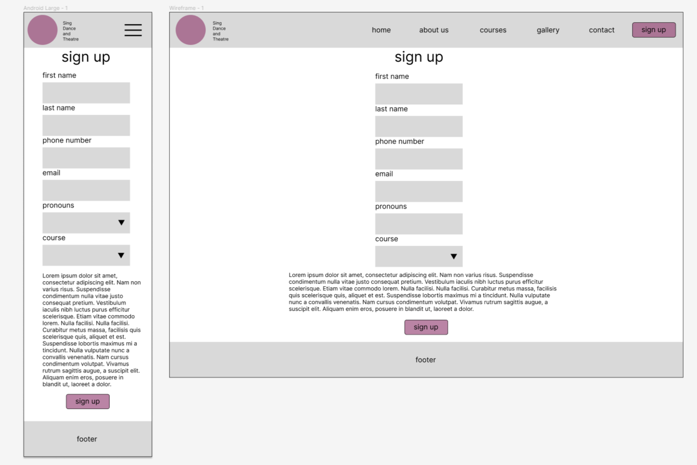

# Musical Theatre Berlin

Located in the vibrant cultural hub of Berlin, Musical Theatre Berlin stands as a beacon of creativity and talent. Nestled amidst the city's rich artistic heritage, our institution offers a dynamic environment where aspiring performers cultivate their skills and passion for the stage. With a diverse curriculum blending rigorous training in acting, singing, and dancing, our experienced faculty guide students through a transformative journey towards artistic excellence. Through collaborative projects, live performances, and immersive experiences, we foster a supportive community that celebrates individuality and fosters collective growth. Whether dreaming of dazzling audiences on Broadway or gracing the stages of Europe's renowned theaters, our students emerge prepared to shine in the spotlight of the global stage.

**Sing! Dance! Act!**

You can visit the deployed site here [Musical Theatre Berlin](https://enniovilla.github.io/project-1-ci/)

## Content

## User Experience (UX)

### User Stories

#### First Time User

* I want to take musical theater classes.
* I want the site to be responsive on my device.
* I want the information to be easy to find.
* I want the site to be easy to navigate

#### Returning User

* I want to check the starting dates
* I want to contact the school
* I want to sign up

## Design

### Site Structure

The website consists of 6 page website that the user can navigate via the navigation bar, being the Home page the default loading page. The logo is in the top left corner and the menu is in the top right corner. In the middle is the name Musical Theatre Berlin, which is clickable and takes you to the home page. This navigation bar on small screen devices ends up centralizing the three elements and the menu becomes a dropdown menu.

### Wireframes

Figma was the software I opted to create the wireframes. I created wireframes for mobile and desktop. Click on the button below to see them.

Wireframes

  

Home page 

  

About us page 

  

Courses page 

  

Gallery page 

  

Contact page 

  

Sign Up page 

### Color Scheme

I wanted to play around with the colors a bit, so I chose to keep the navigation bar in a light color and the top part of the background always in a dark tone and the bottom part in a light tone, since the footer is in a dark tone, so I could have a nice contrast on the page and not irritating the user's eyes.

On the website I used a background image created in Canvas in purple/dark blue with musical notes in grayish colors and on the pages where I didn't use this image, I used a gradient of the dark tone with the light tone, orange, thus playing with colors going from the darkest to the lightest tone.