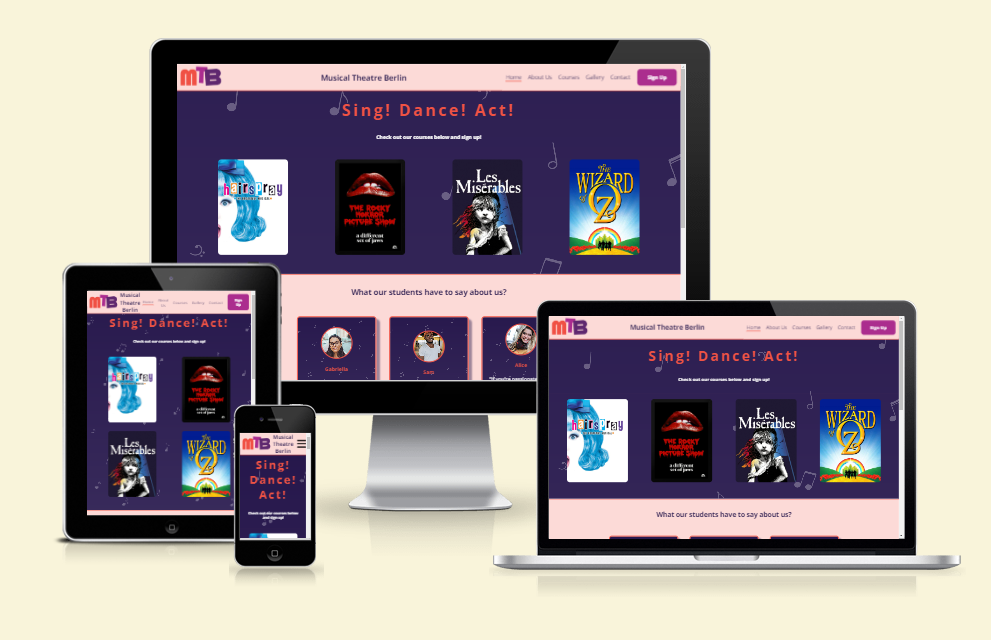

# Musical Theatre Berlin

Located in the vibrant cultural hub of Berlin, Musical Theatre Berlin stands as a beacon of creativity and talent. Nestled amidst the city's rich artistic heritage, our institution offers a dynamic environment where aspiring performers cultivate their skills and passion for the stage. With a diverse curriculum blending rigorous training in acting, singing, and dancing, our experienced faculty guide students through a transformative journey towards artistic excellence. Through collaborative projects, live performances, and immersive experiences, we foster a supportive community that celebrates individuality and fosters collective growth. Whether dreaming of dazzling audiences on Broadway or gracing the stages of Europe's renowned theaters, our students emerge prepared to shine in the spotlight of the global stage.

**Sing! Dance! Act!**

You can visit the deployed site here [Musical Theatre Berlin](https://enniovilla.github.io/project-1-ci/)

## Content

## User Experience (UX)

### User Stories

#### First Time User

* I want to take musical theater classes.
* I want the site to be responsive on my device.
* I want the information to be easy to find.
* I want the site to be easy to navigate

#### Returning User

* I want to check the starting dates
* I want to contact the school
* I want to sign up