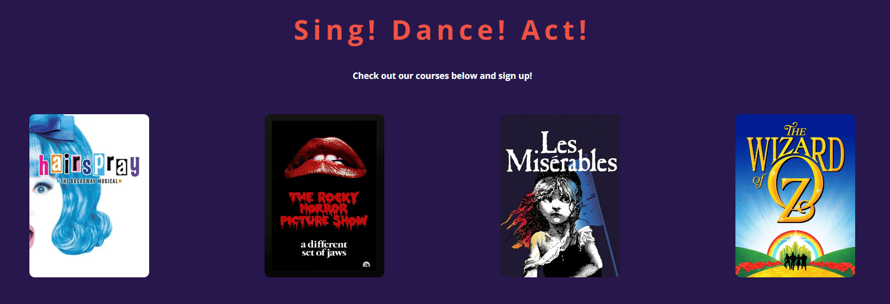
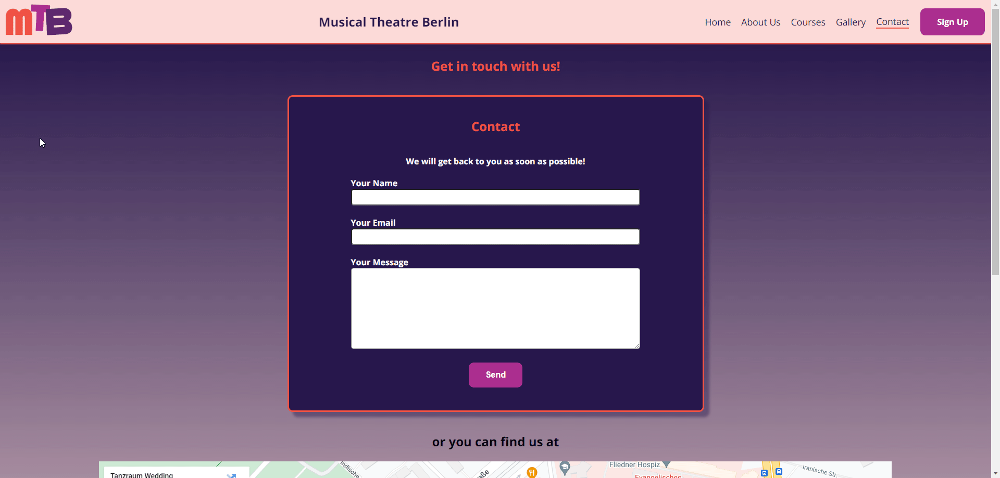

# Musical Theater Berlinsite

Located in the vibrant cultural hub of Berlin, Musical Theater Berlin stands as a beacon of creativity and talent. Nestled amidst the city's rich artistic heritage, our institution offers a dynamic environment where aspiring performers cultivate their skills and passion for the stage. With a diverse curriculum blending rigorous training in acting, singing, and dancing, our experienced faculty guide students through a transformative journey towards artistic excellence. Through collaborative projects, live performances, and immersive experiences, we foster a supportive community that celebrates individuality and fosters collective growth. Whether dreaming of dazzling audiences on Broadway or gracing the stages of Europe's renowned theaters, our students emerge prepared to shine in the spotlight of the global stage.

**Sing! Dance! Act!**

Visit the deployed website here → [Musical Theater Berlin](https://enniovilla.github.io/project-1-ci/)

## Content

## User Experience (UX)

### User Stories

#### First Time User

* I want to take musical theater classes.
* I want the website to be responsive on my device.
* I want the information to be easy to find.
* I want the website to be easy to navigate

#### Returning User

* I want to check the starting dates
* I want to contact the school
* I want to sign up

## Design

### Website Structure

The website consists of 6 page website that the user can navigate via the navigation bar, being the Home page the default loading page. The logo is in the top left corner and the menu is in the top right corner. In the middle is the name Musical Theater Berlin, which is clickable and takes the user to the home page. This navigation bar on small screen devices ends up centralizing the three elements and the menu becomes a dropdown menu.

### Wireframes

Figma was the software I opted to create the wireframes. I created wireframes for mobile and desktop. Click on the button below to see them.

Wireframes

  
Home page 

  
About us page 

  
Courses page 

  
Gallery page 

  
Contact page 

  
Sign Up page 

### Color Scheme

I wanted to play around with the colors a bit, so I chose to keep the navigation bar in a light color and the top part of the background always in a dark tone and the bottom part in a light tone, since the footer is in a dark tone, so I could have a nice contrast on the page and not irritating the user's eyes.

On the website I used a background image created in Canva in purple/dark blue with musical notes in grayish colors and on the pages where I didn't use this image, I used a gradient of the dark tone with the light tone, thus playing with colors going from the darkest to the lightest tone.

- I used the color `#FCDAD7` in the navigation bar.
- I used the color `#F05244` for the edges of the containers on every page of the website. This color also appears when the user hovers over the buttons and the posters on the main page.
- The gradient in the background when I didn't use the background image is made with the colors `#26174B` and `#FCDAD7`.
- The background image created on Canva has color `#26174B`.
- On the buttons I chose `#AB2D8` to be the color.
- The logo has three colors: `#F05244`, `#AB2D8` and `#5E276F`.

### Typography

The font I chose to use is [Open Sans](https://fonts.google.com/specimen/Open+Sans) from Google Fonts and as a fall back font, sans-serif.

## Features and Future Features

### Features

This website includes 6 pages and all of them are responsive. They are: Home, About Us, Courses, Gallery, Contact and Sign Up. On each page we have:

- A favicon. 

- A navigation bar with clickable logo and names that will take the ser to the home page and the menu with sign up button highlighted to facilitate the user experience. If the user can scroll down, the navigation bar will be fixed at the top of the screen for easy access.

### The Home Page

On the home page the user will find the message **Sing! Dance! Act!** which clearly gives the idea of what the website is about. Below that the user will also find the poster of the upcoming courses, which are highlighted when hovering over them and are clickable, taking to the description of each course if clicked.

At the bottom of the page there are some cards with testimonials from former students and just below that a more recent youtube video of a piece from the school that doesn't autoplay.

### The About Us Page

This page comprises the story of the school and a short biography of the teachers and staff.

### The Courses Page

On this page the user can see the description of the courses, the start and end date, as well as the button that takes them to the sign up page under each of the posters.

### Gallery Page

Here the user will find pictures of the school's latest works.

### Contact Page

There is a contact form and the school's Google Maps location so that the user can locate the school.

### Sign Up Page

Anyone wishing to enroll in one of the courses can do so on this page, which contains the sign up form and the terms and conditions.

### Future Features

One feature I would like to have in the future is a carousel with images of course posters instead of having them static.

## Technologies Used

- HTML5 to create the website structure.
- CSS3 to style the website.
- [Git](https://git-scm.com/) for version control.
- [GitPod](https://www.gitpod.io/) as IDE to create the website.
- [GitHub](https://github.com/) to store files for the website.
- [Figma](https://www.figma.com/) to create the wireframes.
- [Chat GPT](https://chat.openai.com/) to generate fictional texts about the school's history and people's biographies.
- [Google Fonts](https://fonts.google.com/) to import the font used on the website.
- [Favicon.io](https://favicon.io/) to create favicon.
- [Am I Responsive?](https://ui.dev/amiresponsive) to display the website image across various devices.
- [Font Awesome](https://fontawesome.com/) to add icons on the website.
- [Canva](https://www.canva.com/) to create the website's background image.

## Deployment, Fork and Clone

### Deployment

1. Log in to Github.
2. Go to the repository for the project.
3. Click the settings button.
4. Select **Pages** in the left navigation menu under Code and Automation.
5. From the source dropdown select main branch and root. Press the save button.
6. The site has been deployed. It may take a few minutes before the site goes live.

### How to Fork

1. Log in to Github.
2. Go to the repository for the project.
3. Click the Fork button in the top right corner.

## How to Clone

1. Log in to GitHub.
2. Go to the repository for the project.
3. Click on the green code button and select if you would like to clone with HTTPS, SSH or GitHub CLI and copy the link below.
4. Navigate to the directory where you want to clone the repository and open terminal.
5. Type 'git clone' into the terminal and paste the link you have from number 3. Press enter. This command will download the entire repository to your local machine.