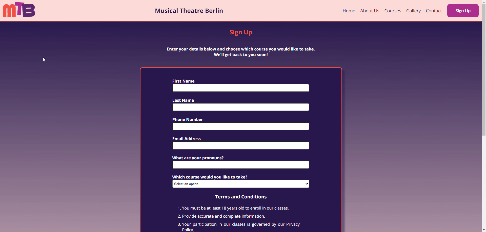
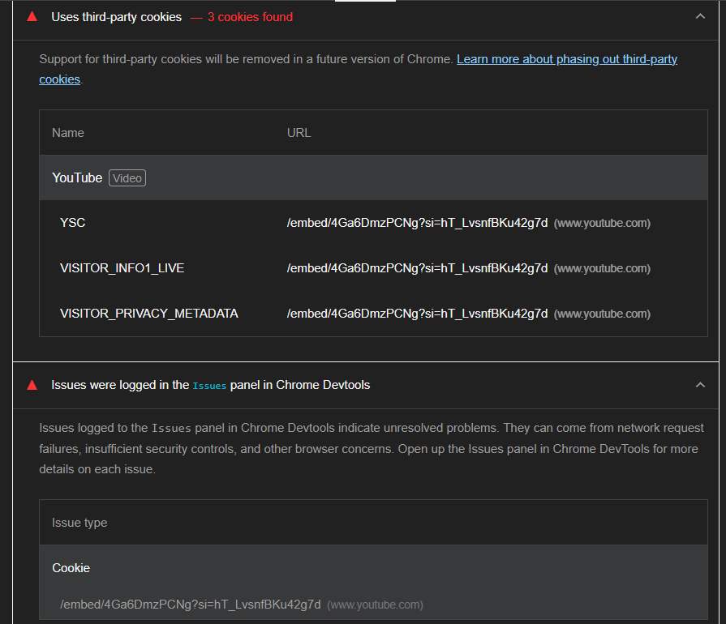
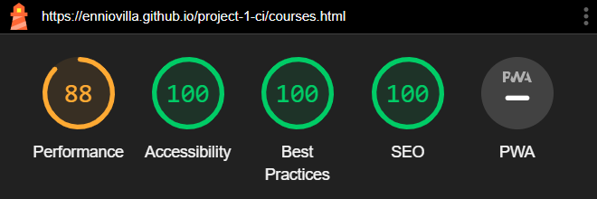
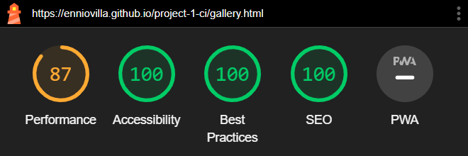
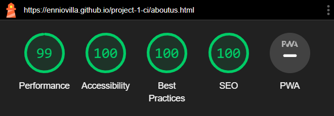
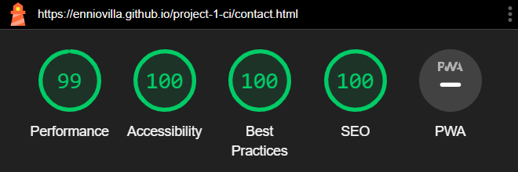
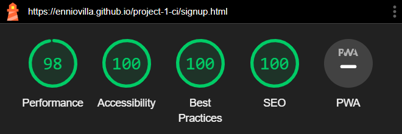

# Musical Theater Berlin

Located in the vibrant cultural hub of Berlin, Musical Theater Berlin stands as a beacon of creativity and talent. Nestled amidst the city's rich artistic heritage, our institution offers a dynamic environment where aspiring performers cultivate their skills and passion for the stage. With a diverse curriculum blending rigorous training in acting, singing, and dancing, our experienced faculty guide students through a transformative journey towards artistic excellence. Through collaborative projects, live performances, and immersive experiences, we foster a supportive community that celebrates individuality and fosters collective growth. Whether dreaming of dazzling audiences on Broadway or gracing the stages of Europe's renowned theaters, our students emerge prepared to shine in the spotlight of the global stage.

**Sing! Dance! Act!**

Visit the deployed website here → [Musical Theater Berlin](https://enniovilla.github.io/project-1-ci/)

## Content

* [User Experience](#user-experience-ux)
    * [User Stories](#user-stories)
* [Design](#design)
    * [Website Structure](#website-structure)
    * [Wireframes](#wireframes)
    * [Color Scheme](#color-scheme)
    * [Typography](#typography)
* [Features and Future Features](#features-and-future-features)
    * [Features](#features)
    * [Future Features](#future-features)
* [Technologies Used](#technologies-used)
* [Deployment, Fork and Clone](#deployment-fork-and-clone)
    * [Deployment](#deployment)
    * [Fork](#how-to-fork)
    * [Clone](#how-to-clone)
* [Testing](#testing)
    * [Testing User Stories](#testing-user-stories)
    * [Automated Testing](#automated-testing)
    * [Manual Testing](#manual-testing)
* [Bugs](#bugs)
    * [Known Bugs](#known-bugs)
* [Credits](#credits)
* [Content](#content)
* [Media](#media)
* [Acknowledgments](#acknowledgments)

## User Experience (UX)

### User Stories

#### First Time User

* I want to take musical theater classes.
* I want the website to be responsive on my device.
* I want the information to be easy to find.
* I want the website to be easy to navigate

#### Returning User

* I want to check the starting dates
* I want to contact the school
* I want to sign up

#### Frequent User

* I want to check the new courses

[Back to top](<#content>)

## Design

### Website Structure

The website consists of 6-page website that the user can navigate via the navigation bar, being the Home page the default loading page. The logo is in the top left corner and the menu is in the top right corner. In the middle is the name Musical Theater Berlin, which is clickable and takes the user to the home page. This navigation bar on small screen devices ends up centralizing the three elements and the menu becomes a dropdown menu.

### Wireframes

Figma was the software I opted to create the wireframes. I created wireframes for mobile and desktop. Click on the button below to see them.

Wireframes

  
Home page 

  
About us page 

  
Courses page 

  
Gallery page 

  
Contact page 

  
Sign Up page 

### Color Scheme

I wanted to play around with the colors a bit, so I chose to keep the navigation bar in a light color and the top part of the background always in a dark tone and the bottom part in a light tone, since the footer is in a dark tone, so I could have a nice contrast on the page and not irritating the user's eyes.

On the website I used a gradient of the dark tone with the light tone, thus playing with colors going from the darkest to the lightest tone.

- I used the color `#FCDAD7` in the navigation bar.
- I used the color `#F05244` for the edges of the containers on every page of the website. This color also appears when the user hovers over the buttons and the posters on the main page.
- The gradient in the background is made with the colors `#26174B` and `#FCDAD7`.
- On the buttons I chose `#AB2D8` to be the color.
- The logo has three colors: `#F05244`, `#AB2D8` and `#5E276F`.

### Typography

The font I chose to use is [Open Sans](https://fonts.google.com/specimen/Open+Sans) from Google Fonts and as a fall back font, sans-serif.

[Back to top](<#content>)

## Features and Future Features

### Features

This website includes 6 pages and all of them are responsive. They are: Home, About Us, Courses, Gallery, Contact and Sign Up. On each page we have:

- A favicon. 

- A navigation bar with clickable logo and names that will take the user to the home page and the menu with sign up button highlighted to facilitate the user experience. If the user can scroll down, the navigation bar will be fixed at the top of the screen for easy access.

### The Home Page

On the home page the user will find the message **Sing! Dance! Act!** which clearly gives the idea of what the website is about. Below that the user will also find the poster of the upcoming courses, which are highlighted when hovering over them and are clickable, taking to the description of each course if clicked.

At the bottom of the page there are some cards with testimonials from former students and just below that a more recent YouTube video of a piece from the school that doesn't autoplay.

### The About Us Page

This page comprises the history of the school and a short biography of the teachers and staff.

### The Courses Page

On this page the user can see the description of the courses, the start and end date, as well as the button that takes them to the sign-up page under each of the posters.

### Gallery Page

Here the user will find pictures of the school's latest works.

### Contact Page

There is a contact form and the school's Google Maps location so that the user can locate the school.

### Sign Up Page

Anyone wishing to enroll in one of the courses can do so on this page, which contains the sign-up form and the terms and conditions.

### Future Features

- I would like to have a carousel with images of current courses posters instead of having them static
- I would like to have a pop-up window with upcoming courses' images when the visitor accesses the website.

[Back to top](<#content>)

## Technologies Used

- HTML5 to create the website structure.
- CSS3 to style the website.
- [Git](https://git-scm.com/) for version control.
- [GitPod](https://www.gitpod.io/) as IDE to create the website.
- [GitHub](https://github.com/) to store files for the website.
- [Figma](https://www.figma.com/) to create the wireframes.
- [Chat GPT](https://chat.openai.com/) to generate fictional texts about the school's history and people's biographies.
- [Google Fonts](https://fonts.google.com/) to import the font used on the website.
- [Favicon.io](https://favicon.io/) to create favicon.
- [Am I Responsive?](https://ui.dev/amiresponsive) to display the website image across various devices.
- [Font Awesome](https://fontawesome.com/) to add icons on the website.
- [Pixelied](https://pixelied.com/) to convert images to WebP.
- [Tinify](https://tinypng.com/) to compress images.
- [Appetize.io](https://appetize.io/) to simulate the iOS environment.

[Back to top](<#content>)

## Deployment, Fork and Clone

### Deployment

1. Log in to GitHub.
2. Go to the repository for the project.
3. Click the settings button.
4. Select **Pages** in the left navigation menu under Code and Automation.
5. From the source dropdown select main branch and root. Press the save button.
6. The site has been deployed. It may take a few minutes before the site goes live.

### How to Fork

1. Log in to GitHub.
2. Go to the repository for the project.
3. Click the Fork button in the top right corner.

### How to Clone

1. Log in to GitHub.
2. Go to the repository for the project.
3. Click on the **green code button** and select if you would like to clone with HTTPS, SSH or GitHub CLI and copy the link below.
4. Navigate to the directory where you want to clone the repository and open terminal.
5. Type *git clone* into the terminal and paste the link you have from number 3. Press enter. This command will download the entire repository to your local machine.

[Back to top](<#content>)

## Testing

### Testing User Stories

- First time visitors

| Expectation | Result |
| :--- | :--- |
| I want to enroll in a musical theater school. | I have created a website that is very easy to understand its goal since the first page. |
| I want the website to have easy navigation. | I have created a website with easy navigation bar and buttons. |
| I want responsiveness from my website. | The website has full responsiveness. |

- Returning Visitors

| Expectation | Result |
| :--- | :--- |
| I want to see which courses the school has to offer. | The user can see this information by clicking the button "Courses" in the navigation bar or click on the posters on the home page. |
| I want to sign up for the courses. | I have created a highlighted Sign Up button in the navigation bar and below each course description on the courses page. |
| I want to enroll in the school easily. | The sign-up form has very few boxes to fill. |

- Frequent Visitors

| Expectation | Result |
| :--- | :--- |
| I want to see if the school has new courses to offer. | I have created a display on the home page, so the user can easily see our current courses. |

### Manual Testing

I tested all the buttons and links throughout the creation of the website and did a final test. The result of the final test is below.

| Feature | Expectation | Action | Result |
| :--- | :--- | :--- | :--- |
| Website's Logo | Takes the user to the home page. | Clicked Logo. | Home page loads. |
| Website's Title | Takes the user to the home page. | Clicked Title. | Home page loads. |
| Navigation bar buttons | Takes the user to the respective page. | Clicked button. | Respective page loads. |
| Stylized buttons | Change color when the mouse hovers over them.| Hovered mouse over buttons. | The color changes. |
| Musical posters on the home page | Highlighted when the mouse hovers over them. | Hovered mouse over posters. | Highlights border. |
| Sign up and Send buttons | Submit forms. | Clicked button. | Submit form. |
| Send form without white space | Form cannot be sent with white spaces. | Tested submitting with white space on each label. | The form is not sent. |
| Social media links | Social media links should open externally. | Clicked on social media icons at the bottom of the page. | The links open externally. |

#### Browser Testing

I tested the website in different browsers, both on computer and mobile.

| Browser | Result |
| :--- | :--- |
| Google Chrome | The website is responsive. |
| Microsoft Edge | The website is responsive. |
| Mozilla Firefox | The website is responsive. |
| Opera | The website is responsive. |

### Automated Testing

#### W3C Validator
[W3C](https://validator.w3.org/) checked the HTML of the 6 pages, and they passed the validation. A warning message shows up in all validations due to importing the font from Google Fonts.  The full results of the validations are shown below.
- [Home page](documentation/testing/index.pdf)
- [About Us page](documentation/testing/about-us.pdf)
- [Courses page](documentation/testing/courses.pdf)
- [Gallery page](documentation/testing/gallery.pdf)
- [Contact page](documentation/testing/contact.pdf)
- [Sign Up page](documentation/testing/signup.pdf)

#### CSS Validator
The CSS was validated by [W3C Jigsaw](https://jigsaw.w3.org/css-validator/) and passed the test. To see the full result, click on the name below.
- [CSS](documentation/testing/css-validation.pdf)

#### Lighthouse

I used Lighthouse to test the full performance of the website.

Mobile Results

 
Home page 
  
The value of Best Practices is low because of YouTube's cookies. 

  
About Us page 

  
Courses page 

  
Gallery page 

  
Contact page 

  
Sign Up page 

  

 

Desktop Results

 
Home page 
  
The value of Best Practices is low because of YouTube's cookies. 

  
About Us page 

  
Courses page 

  
Gallery page 

  
Contact page 

  
Sign Up page 

  

 

[Back to top](<#content>)

## Bugs

### Known Bugs

The website doesn't work as expected in the Safari browser for iOS and I couldn't do any extra tests because I don't have any Apple product. You can see that you can scroll down, but the navigation bar takes up the whole screen, the logo is completely stretched out and the menu doesn't open. I used appetize.io to simulate the iPhone 15 Pro Max.

[Back to top](<#content>)

## Credits

- All the features of my website were developed with the guidance of the lessons from the Code Institute's Love Running project.
- I used [Kera Cudmore's Quiz Arms Readme](https://github.com/kera-cudmore/TheQuizArms/blob/main/README.md) as an inspiration for my project's Readme.
- Kevin Powell helped me understand flexbox with [this video](https://www.youtube.com/watch?v=u044iM9xsWU&t=986s) and Figma with [this one](https://www.youtube.com/watch?v=eZJOSK4gXl4&t=1206s).
- [The ultimate guide to web performance](https://www.youtube.com/watch?v=0fONene3OIA) was useful to make me understand how to improve the performance of my website.

## Content

- People's biographies and the school's history were generated by [Chat GPT](https://chat.openai.com/).
- The synopsis of each musical was taken from [Stageagent](https://stageagent.com/).

## Media

The chosen images were taken from Google Images and [Pexels](https://www.pexels.com/).

- Musical poster
[Hairspray](https://destinationmansfield.com/event/hairspray-the-musical-at-renaissance-theatre/2021-07-31/)
[Rocky Horror Show](https://dutchmuseumgiftshop.nl/de/produkt/rocky-horror-picture-show-poster/)
[Les Misérables](https://br.pinterest.com/pin/31032684909024269/)
[The Wizard of Oz](https://www.concordtheatricals.de/wizard-of-oz.html)

- Testimony
[First person](https://www.pexels.com/de-de/foto/selektiver-fokus-fotografie-der-frau-1239288/)
[Second person](https://www.pexels.com/photo/smiling-man-in-white-shirt-6740141/)
[Third Person](https://www.pexels.com/de-de/foto/eine-gluckliche-frau-im-lila-schal-die-musik-hort-3781789/)

- The Team
[Laura](https://www.pexels.com/photo/woman-in-collared-shirt-774909/)
[Jennifer](https://www.pexels.com/photo/positive-asian-woman-wearing-white-blouse-in-studio-7626573/)
[Eliza](https://www.pexels.com/de-de/foto/frau-die-brille-tragt-773371/)
[Mark](https://www.pexels.com/photo/happy-young-man-in-jacket-and-beige-pants-18185492/)
[Sade](https://www.pexels.com/de-de/foto/foto-der-frau-die-kopftuch-tragt-1820919/)
[Matteo](https://www.pexels.com/photo/man-in-white-shirt-709188/)

- Gallery
[Photo 1](https://www.pexels.com/de-de/foto/mann-reflektierung-spiegelung-reflexion-4716578/)
[Photo 2](https://www.pexels.com/photo/two-men-and-woman-wearing-different-costumes-6899941/)
[Photo 3](https://www.pexels.com/photo/man-and-woman-dancing-6899942/)
[Photo 4](https://www.pexels.com/photo/people-sitting-on-theater-chairs-4061506/)
[Photo 5](https://www.pexels.com/photo/woman-in-black-and-white-dress-reading-a-book-13607537/)
[Photo 6](https://www.pexels.com/photo/crop-black-man-putting-on-drag-queen-costume-7675997/)
[Photo 7](https://www.pexels.com/photo/woman-wearing-creative-makeup-wrapped-in-blue-feather-13681744/)
[Photo 8](https://www.pexels.com/de-de/foto/frau-die-ihre-hande-hebt-2506776/)

## Acknowledgments

I would like to acknowledge:
- Kay Welfare - My cohort facilitator.
- Jubril Akolade - My Code Institute mentor.
- My friends who are supporting me and understand if I can't hang out with them because I need to finish my project.

[Back to top](<#content>)
