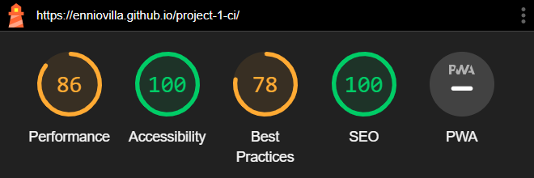

    * [Testing User Stories](#testing-user-stories)
    * [Automated Testing](#automated-testing)
    * [Manual Testing](#manual-testing)

### Testing User Stories

- First time visitors

| Expectation | Result |
| :--- | :--- |
| I want to enroll in a musical theater school. | I have created a website that is very easy to understand its goal since the first page. |
| I want the website to have easy navigation. | I have created a website with easy navigation bar and buttons. |
| I want responsiveness from my website. | The website has full responsiveness. |

- Returning Visitors

| Expectation | Result |
| :--- | :--- |
| I want to see which courses the school has to offer. | The user can see this information by clicking the button "Courses" in the navigation bar or click on the posters on the home page. |
| I want to sign up for the courses. | I have created a highlighted Sign Up button in the navigation bar and below each course description on the courses page. |
| I want to enroll in the school easily. | The sign-up form has very few boxes to fill. |

- Frequent Visitors

| Expectation | Result |
| :--- | :--- |
| I want to see if the school has new courses to offer. | I have created a display on the home page, so the user can easily see our current courses. |

### Manual Testing

I tested all the buttons and links throughout the creation of the website and did a final test. The result of the final test is below.

| Feature | Expectation | Action | Result |
| :--- | :--- | :--- | :--- |
| Website's Logo | Takes the user to the home page. | Clicked Logo. | Home page loads. |
| Website's Title | Takes the user to the home page. | Clicked Title. | Home page loads. |
| Navigation bar buttons | Takes the user to the respective page. | Clicked button. | Respective page loads. |
| Stylized buttons | Change color when the mouse hovers over them.| Hovered mouse over buttons. | The color changes. |
| Musical posters on the home page | Highlighted when the mouse hovers over them. | Hovered mouse over posters. | Highlights border. |
| Sign up and Send buttons | Submit forms. | Clicked button. | Submit form. |
| Send form without white space | Form cannot be sent with white spaces. | Tested submitting with white space on each label. | The form is not sent. |
| Social media links | Social media links should open externally. | Clicked on social media icons at the bottom of the page. | The links open externally. |

#### Browser Testing

I tested the website in different browsers, both on computer and mobile.

| Browser | Result |
| :--- | :--- |
| Google Chrome | The website is responsive. |
| Microsoft Edge | The website is responsive. |
| Mozilla Firefox | The website is responsive. |
| Opera | The website is responsive. |

### Automated Testing

#### W3C Validator
[W3C](https://validator.w3.org/) checked the HTML of the 6 pages, and they passed the validation. A warning message shows up in all validations due to importing the font from Google Fonts.  The full results of the validations are shown below.
- [Home page](documentation/testing/index.pdf)
- [About Us page](documentation/testing/about-us.pdf)
- [Courses page](documentation/testing/courses.pdf)
- [Gallery page](documentation/testing/gallery.pdf)
- [Contact page](documentation/testing/contact.pdf)
- [Sign Up page](documentation/testing/signup.pdf)

#### CSS Validator
The CSS was validated by [W3C Jigsaw](https://jigsaw.w3.org/css-validator/) and passed the test. To see the full result, click on the name below.
- [CSS](documentation/testing/css-validation.pdf)

#### Lighthouse

I used Lighthouse to test the full performance of the website.

Mobile Results

 
Home page 
  
The value of Best Practices is low because of YouTube's cookies. 

  
About Us page 

  
Courses page 

  
Gallery page 

  
Contact page 

  
Sign Up page 

  

 

Desktop Results

 
Home page 
  
The value of Best Practices is low because of YouTube's cookies. 

  
About Us page 

  
Courses page 

  
Gallery page 

  
Contact page 

  
Sign Up page 

  

 

[Back to top](<#content>)